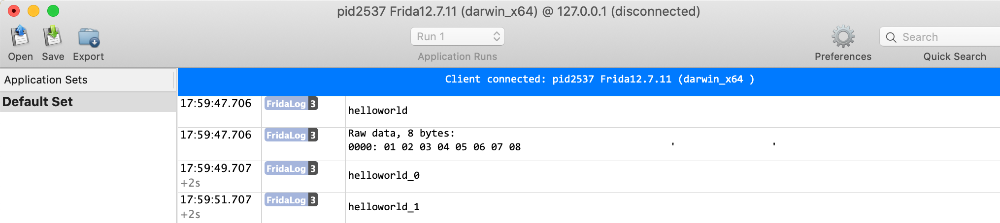

FridaLogger is a logging utility which display frida log in [NSLogger](https://github.com/fpillet/NSLogger)

## Usage

```TypeScript
import { Logger } from "./logger";
import { swapInt64 } from "./logger";

// connect to FridaNSLoggerViewer
const logger = new Logger('127.0.0.1', 50010);
logger.logStr('helloworld');

const testS64 = new Int64('0x0102030405060708');
const testBuf = Memory.alloc(8).writeS64( swapInt64(testS64) ).readByteArray(8);
logger.logBinary(testBuf as ArrayBuffer);
```

The `MacViewer` contains FridaNSLoggerViewer.app, which used as a MacOS server to accept clients and display logs. It is modified on NSLogger 
so can accept raw tcp socket data without tls. 

## Features

* send log message in Frida TypeScript
* support string and binary log message
* reconnect after disconnection
* use with a MacOS app: FridaNSLoggerViewer



